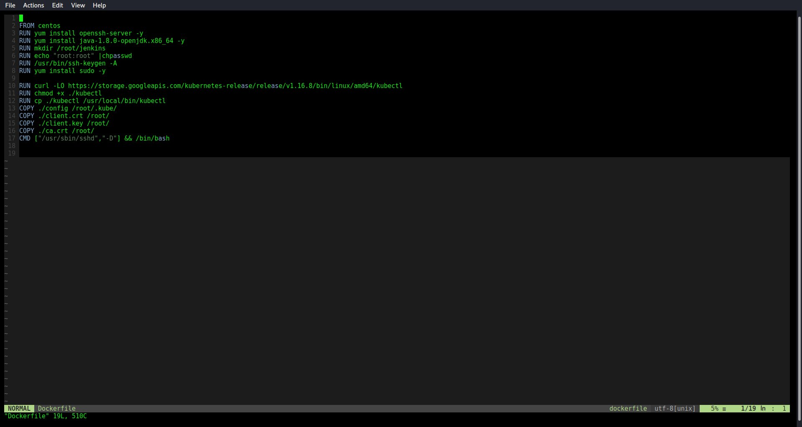
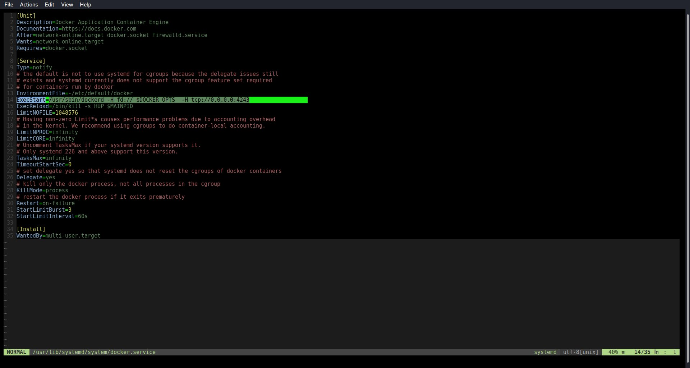

# DEVOPS_TASK_4
### Here is i use Jenkins bcz Jenkins supports the master-agent architecture (many build agents completing work scheduled by a master server) making it highly scalable. The master’s job is to schedule build jobs, distribute the jobs to agents for actual execution, monitor the agents, and get the build results. Master servers can also execute build job directly.

### The agents’ task is to build the job sent by the master. A job can be configured to run on a particular type of agent, or if there are no special requirements, Jenkins can simply choose the next available agent.

### This project will help to deploy a website using a Dynamic Distributed Jenkins Cluster on Kubernetes using a remote Slave Node. Everything is configured in such a way that at the moment developer will commit the Dockerfile and webUI code on GitHub, the slave will launch the Distributed cluster and the image will be built and pushed to Dockerhub and the Deployment will be started on K8s. If the developer updates the code and recommits it, the Cluster will use its Rolling Updates feature to update the Website and the website will be uploaded with zero Down Time.

## TASK DESCRIPTION

### Create container image that’s has Linux and other basic configuration required to run Slave for Jenkins. ( example here we require kubectl to be configured ) 


### The slave image should have the ssh enabled with credentials and the root directory , java installed

### Here i create Dockerfile for building an image which would work as Jenkins Agent having kubectl setup.

### here i create a config file for k8s this help me  When i launch the job it should automatically starts job on slave based on the label provided for dynamic approach.


### I configure docker service file for launching the Dynamic slave using Docker containers remotely ,we have to do the following changes in the /usr/lib/systemd/system/docker.service so that the docker client can remotely connect to docker server.
### here i add 
```
-H tcp://0.0.0.0:<port_number>
```



### when we sucessfully changing in the service file, then  to update internal settings we need to run the following commands
```
       systemctl daemon-reload

       systemctl restart docker 
```
### Now I Configure Cloud Node  in Jenkins
### First of all for this setup we need to have Docker plugin installed. 
